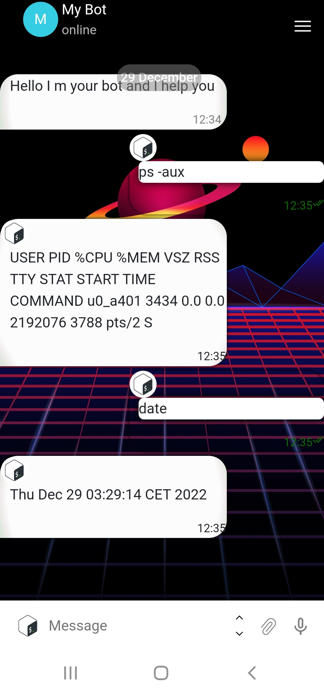
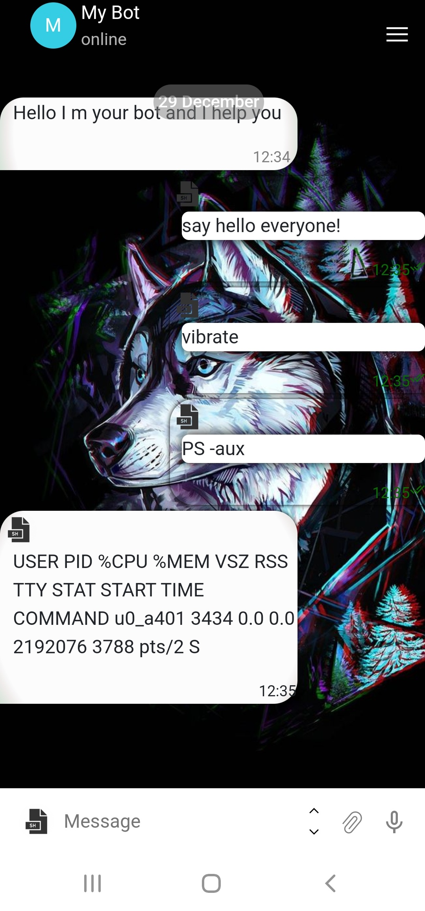
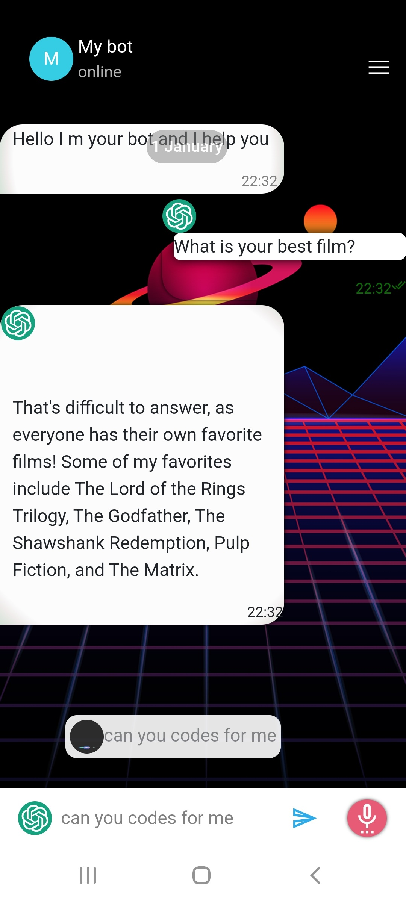

<p align="center">
  
</p>
<h1 align="center">Chat-bot-GPT-Bash</h1>
<p align="center">
  
  
  
 
</p>
<p align="center">
  
  
  
</p>
<h2 align="center">A telegram chat to communicate with chat gpt and execute shell commands and scripts</h2>
<p align="center">
  
</p>

**`Installation`**

```
$ git clone https://github.com/Lucstay11/Chat-bot-GPT-Bash
```

**`Start web server`**

```
$ /Chat-bot-GPT-Bash
php -S 0.0.0.0:8080
```
**`I use php but you can use any web server (apache, python..)`**

<i align="center">To communicate with chat gpt you just have to insert your <b>Api Key</b> in the index.js</i>

<p align="center">
  
   
</p>

<i align="center">Execute shell commands and aliases. Shell commands can be added as arguments over aliases</i>

<p align="center">
  
</p>
**`Customize and configure the chat!`**
